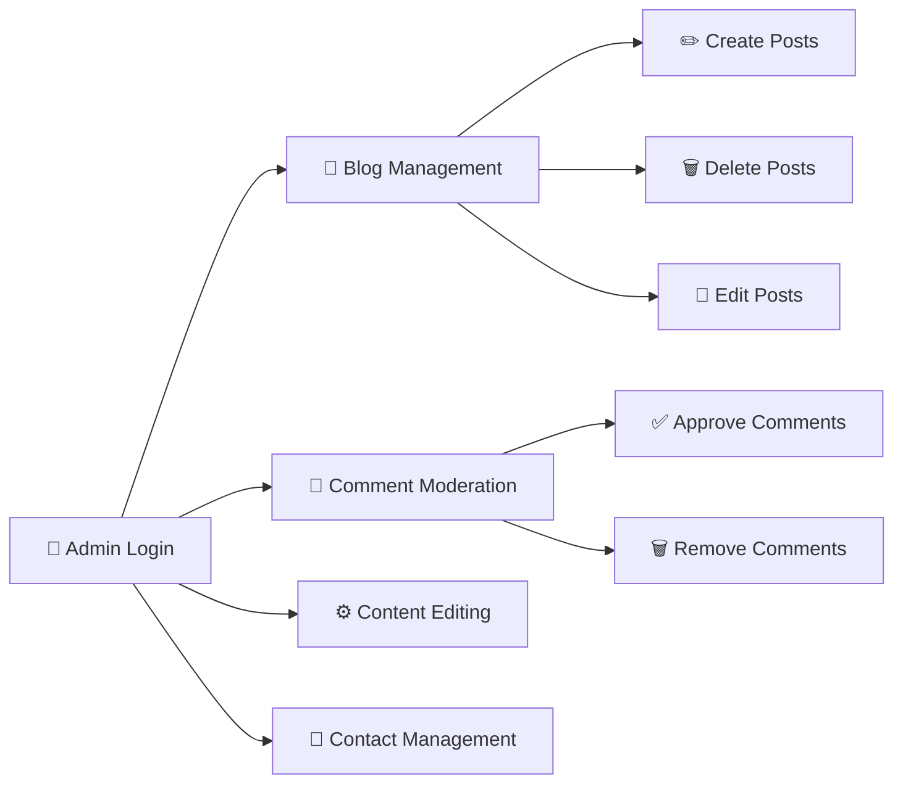

<div align="center">

# 🌟 Learniverse

### *Empowering Education Through Technology*

[](https://reactjs.org/)
[](https://vitejs.dev/)
[](https://tailwindcss.com/)
[](https://php.net/)
[](https://www.mysql.com/)
[](https://firebase.google.com/)

<p align="center">
  <strong>A modern educational platform built with React and PHP</strong><br>
  Featuring dynamic content management, blogs, and community engagement
</p>

[🚀 Demo](https://vishaldahiya.cs.in/) • [📖 Documentation](#-table-of-contents) • [🐛 Report Bug](#-troubleshooting) • [✨ Request Feature](#-support)

</div>

---

## 📑 Table of Contents

- [✨ Features](#-features)
- [🛠️ Tech Stack](#️-tech-stack)
- [📋 Prerequisites](#-prerequisites)
- [⚡ Quick Start](#-quick-start)
- [📁 Project Structure](#-project-structure)
- [🔐 Admin Access](#-admin-access)
- [🌐 Deployment](#-deployment)
- [🔧 API Reference](#-api-reference)
- [🐛 Troubleshooting](#-troubleshooting)
- [📝 License](#-license)

---

## ✨ Features

<table>
<tr>
<td width="50%">

### 🌐 Public Features

- 🏠 **Home Page** - Engaging landing experience
- 📝 **Blog System** - Educational content with comments
- 💬 **Comment System** - Interactive discussions
- ℹ️ **About Page** - Mission, vision & team info
- 📧 **Contact Form** - Easy communication channel
- 🤖 **AI Chatbot** - Smart assistance integration

</td>
<td width="50%">

### 🔐 Admin Features

- 🔑 **Secure Login** - Firebase OTP authentication
- ✍️ **Blog Management** - Full CRUD operations
- 🛡️ **Comment Moderation** - Review & manage feedback
- ⚙️ **Content Editor** - Update about page dynamically
- 📊 **Dashboard** - Manage contact submissions
- 🖼️ **Media Upload** - Image management system

</td>
</tr>
</table>

---

## �️ Tech Stack

<div align="center">

### Frontend Technologies

| Technology | Purpose | Version |
|:---:|:---:|:---:|
|  | UI Library | 19.2.0 |
|  | Build Tool | 7.2.4 |
|  | Styling | 4.1.18 |
|  | Routing | 7.11.0 |
|  | Authentication | 12.7.0 |
|  | Icons | 0.562.0 |

### Backend Technologies

| Technology | Purpose |
|:---:|:---:|
|  | Server-side Logic |
|  | Database |
|  | Web Server |

</div>

---

## 📋 Prerequisites

Before you begin, ensure you have the following installed:

<div align="center">

| Requirement | Version | Download |
|:---:|:---:|:---:|
| 📗 Node.js | v16+ | [Download](https://nodejs.org/) |
| 📦 npm/yarn | Latest | Included with Node |
| 🐘 PHP | v7.4+ | [Download](https://www.php.net/) |
| 🗄️ MySQL | v5.7+ | [Download](https://www.mysql.com/) |
| 🌐 Apache | Latest | [XAMPP](https://www.apachefriends.org/) |

</div>

---

## ⚡ Quick Start

### 🎯 Step 1: Clone the Repository

```bash
git clone <repository-url>
cd "HOD Project"
```

### 📦 Step 2: Install Dependencies

```bash
npm install
```

### 🔑 Step 3: Environment Setup

Create a `.env` file in the root directory:

```env
VITE_FIREBASE_API_KEY=your_firebase_api_key
VITE_BACKEND_URL=http://localhost/backend
```

> 💡 **Tip:** Copy `.env.example` and rename it to `.env`

### 💾 Step 4: Database Setup

**Create Database:**
```sql
CREATE DATABASE learniverse;
```

**Import Schema:**
```bash
mysql -u your_username -p learniverse < backend/database_schema.sql
```

**Import Sample Data (Optional):**
```bash
mysql -u your_username -p learniverse < backend/import_tables.sql
```

### ⚙️ Step 5: Configure Backend

Edit `backend/db_connect.php`:

```php
$host = 'localhost';
$dbname = 'learniverse';
$username = 'your_username';
$password = 'your_password';
```

### 🚀 Step 6: Run the Application

**Start Frontend:**
```bash
npm run dev
```

**Start Backend:**
- Ensure XAMPP/WAMP is running
- Access at `http://localhost:5173`

---

## 📁 Project Structure

```
📦 HOD Project
┣ 📂 backend/                    # PHP Backend
┃ ┣ 📜 .htaccess                 # Apache config
┃ ┣ 📜 db_connect.php            # Database connection
┃ ┣ 📜 about_api.php             # About page API
┃ ┣ 📜 blog_api.php              # Blog posts API
┃ ┣ 📜 comments_api.php          # Comments API
┃ ┣ 📜 save_contact.php          # Contact handler
┃ ┣ 📜 upload.php                # File uploads
┃ ┣ 📜 database_schema.sql       # DB structure
┃ ┗ 📂 uploads/                  # Media files
┣ 📂 src/
┃ ┣ 📂 assets/                   # Static files
┃ ┣ 📂 components/               # React components
┃ ┣ 📂 context/                  # Context providers
┃ ┃ ┣ 📜 AuthContext.jsx         # Auth state
┃ ┃ ┗ 📜 ToastContext.jsx        # Notifications
┃ ┣ 📂 layout/                   # Layout components
┃ ┃ ┗ 📜 Navbar.jsx              # Navigation
┃ ┣ 📂 pages/                    # Page components
┃ ┃ ┣ 📜 Home.jsx
┃ ┃ ┣ 📜 Blog.jsx
┃ ┃ ┣ 📜 About.jsx
┃ ┃ ┣ 📜 Contact.jsx
┃ ┃ ┗ 📜 AdminLogin.jsx
┃ ┣ 📂 services/                 # API services
┃ ┣ 📜 App.jsx                   # Main component
┃ ┣ 📜 firebase.js               # Firebase config
┃ ┗ 📜 main.jsx                  # Entry point
┣ 📜 .env.example                # ENV template
┣ 📜 package.json                # Dependencies
┣ 📜 vite.config.js              # Vite config
┗ 📜 README.md                   # You are here!
```

---

## 🔐 Admin Access

<div align="center">

### 🔑 Login Credentials

| Field | Value |
|:---:|:---:|
| 📱 **Mobile Number** | `9558611538` |
| 🔐 **OTP** | Fixed OTP via Firebase |

### 🎛️ Admin Capabilities



</div>

---

## 🌐 Deployment

### 🎨 Frontend (Vercel/Netlify)

<div align="center">

[](https://vercel.com/new)
[](https://app.netlify.com/start)

</div>

**Steps:**
1. 🔗 Connect your repository
2. ⚙️ Set environment variables
3. 🚀 Deploy!

### 🗄️ Backend (cPanel/Shared Hosting)

1. 📤 Upload backend files via FTP
2. 💾 Create MySQL database
3. 📋 Import `database_schema.sql`
4. ✏️ Update `db_connect.php` credentials
5. 🔒 Set permissions for `uploads/` directory (755)

---

## 🔧 API Reference

<details>
<summary><b>📝 Blog API Endpoints</b></summary>

| Method | Endpoint | Description | Auth |
|:---:|:---|:---|:---:|
| `GET` | `/blog_api.php` | Fetch all blog posts | ❌ |
| `POST` | `/blog_api.php` | Create new post | ✅ |
| `PUT` | `/blog_api.php` | Update post | ✅ |
| `DELETE` | `/blog_api.php` | Delete post | ✅ |

</details>

<details>
<summary><b>💬 Comments API Endpoints</b></summary>

| Method | Endpoint | Description | Auth |
|:---:|:---|:---|:---:|
| `GET` | `/comments_api.php` | Fetch comments | ❌ |
| `POST` | `/comments_api.php` | Add comment | ❌ |
| `DELETE` | `/comments_api.php` | Delete comment | ✅ |

</details>

<details>
<summary><b>ℹ️ Other Endpoints</b></summary>

| Method | Endpoint | Description | Auth |
|:---:|:---|:---|:---:|
| `GET` | `/about_api.php` | Get about data | ❌ |
| `PUT` | `/about_api.php` | Update about | ✅ |
| `POST` | `/save_contact.php` | Submit contact form | ❌ |
| `POST` | `/upload.php` | Upload images | ✅ |

</details>

---

## 🐛 Troubleshooting

<details>
<summary><b>❌ Backend returns HTML instead of JSON</b></summary>

- ✅ Check `.htaccess` configuration
- ✅ Disable PHP error display in production
- ✅ Verify backend URL in `.env`

</details>

<details>
<summary><b>🔌 Database connection errors</b></summary>

- ✅ Verify credentials in `db_connect.php`
- ✅ Ensure MySQL service is running
- ✅ Check if database exists
- ✅ Verify user permissions

</details>

<details>
<summary><b>🔥 Firebase authentication issues</b></summary>

- ✅ Check Firebase config in `src/firebase.js`
- ✅ Verify environment variables
- ✅ Ensure Firebase project is configured
- ✅ Check OTP phone number authentication settings

</details>

<details>
<summary><b>🖼️ Images not loading</b></summary>

- ✅ Check `backend/uploads/` permissions (755)
- ✅ Verify upload path configuration
- ✅ Ensure web server has write access

</details>

---

## 📊 Development Scripts

| Command | Description |
|:---|:---|
| `npm run dev` | 🚀 Start development server |
| `npm run build` | 📦 Build for production |
| `npm run preview` | 👀 Preview production build |
| `npm run lint` | 🔍 Run ESLint |

---

## 📝 License

<div align="center">

📚 **Academic Project**

This project is developed as part of TY SEM-6 HOD Project

</div>

---

## 👥 Contributors

<div align="center">

### 🌟 Development Team

*TY SEM-6 HOD Project*

Made with ❤️ and ☕ by the Learniverse Team

</div>

---

## 📞 Support

<div align="center">

Got questions? We're here to help!

[](https://vishaldahiya.cs.in/contact)
[](mailto:support@learniverse.com)

</div>

---

<div align="center">

### ⭐ Star us on GitHub — it motivates us a lot!

**[⬆ Back to Top](#-learniverse)**

---

*Last Updated: December 2025*

</div>
